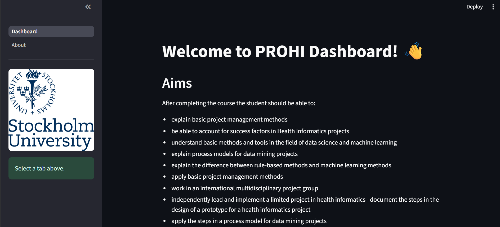
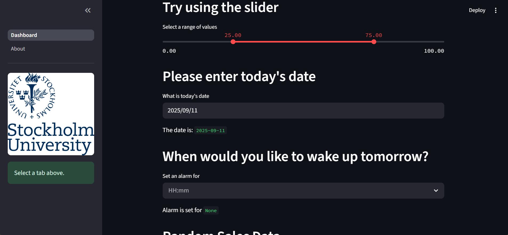
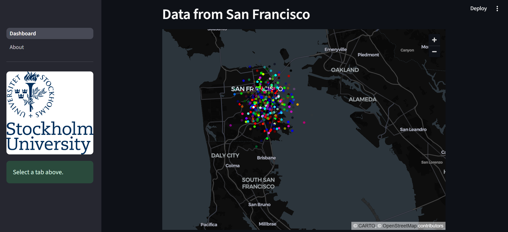
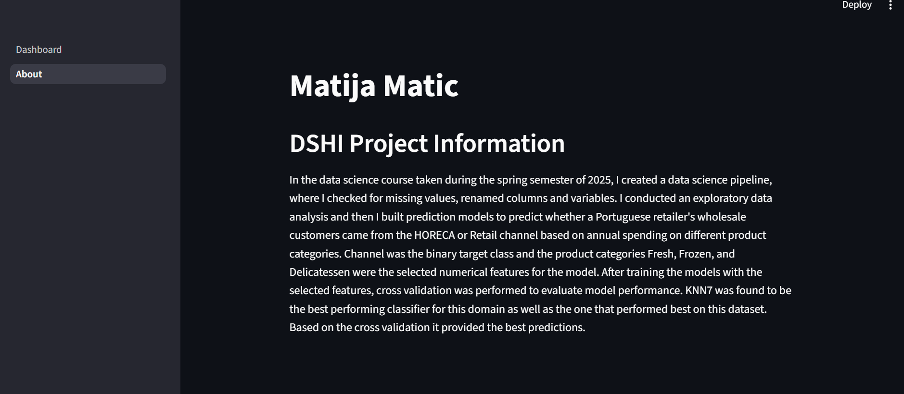

# PROHI Dashboard Example

**Author**: Matija Matic

**Collaborator**: Anton Altmeyer

_Note that this file is written in **MarkDown** language. A reference is available here: <https://www.markdownguide.org/basic-syntax/>_

_Here you can include images, like the logo from SU_


These are screenshots of some of my Dashboard components/widgets:
  (Dashboard page)
  (Dashboard page)
  (Dahboard page)
  (About page)

## Introduction
For Individual Assignment II in the project management class at Stockholm University, I was tasked with creating a custom Streamlit Dashboard. The purpose of this task was to familiarize me with Streamlit. This will enable me to provide valuable contributions to the major Streamlit Dashboard group project that will be completed as part of this course. In the system description below you will find what the components of this dashboard are. 

## System description
A Streamlit dashboard containing 2 pages was created. I included three input widgets, one data widget and one chart widget on the page named Dashboard. There were widgets and text that was included when I received the file which I kept and then added the additional widgets below. The second page named About, which I added, included the author's name as well as information about the data set used and the data science pipeline completed during the spring semester of 2025. Synthetic data was used for the dashboard. 
### Installation of libraries
In order to create the Streamlit dashboard, I had to follow the following steps which had already been provided to me:
Run the commands below in a terminal to configure the project and install the package dependencies for the first time.

1. Create the environment with `python -m venv env`
2. Activate the virtual environment for Python
   - [Linux/Mac] `source env/bin/activate` 
   - [Windows command prompt] `.\env\Scripts\activate.bat` 
   - [in Windows PowerShell] `.\env\Scripts\Activate.ps1`
3. Make sure that your terminal is in the environment (`env`) not in the global Python installation. The terminal should start with the word `env`
4. Install required packages `pip install -r ./requirements.txt`
5. Check that the installation works running `streamlit hello`
6. Stop the terminal by pressing **Ctrl+C**

### Execute custom Dashboard
To execute the created dashboard please follow this step:
First, make sure that you are running Python from the environment. Check the steps 2 and 3 above. Then, to run the custom dashboard execute the following command:

```
> streamlit run Dashboard.py
# If the command above fails, use:
> python -m streamlit run Dashboard.py
```
After making necessary changes and adding different elements/widgets to the dashboard, I followed the steps listed above to execute the dashboard and see what it looked like in a web browser.

### Dependencies

Tested on Python 3.12.7 with the following packages:
  - Jupyter v1.1.1
  - Streamlit v1.46.1
  - Seaborn v0.13.2
  - Plotly v6.2.0
  - Scikit-Learn v1.7.0
  - shap v0.48.0

## Contributors

Author: Matija Matic
Contact Information: matija.matic@stud.ki.se
